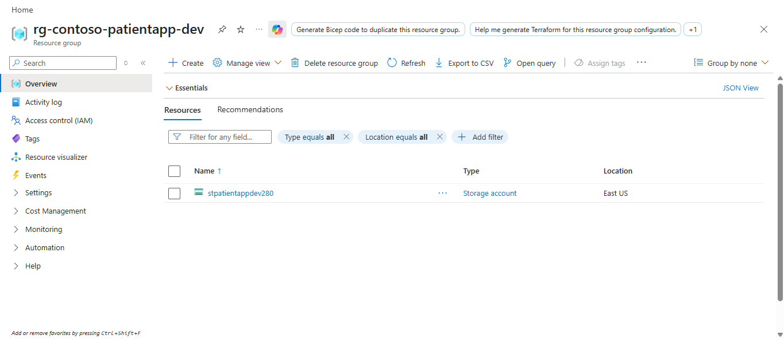
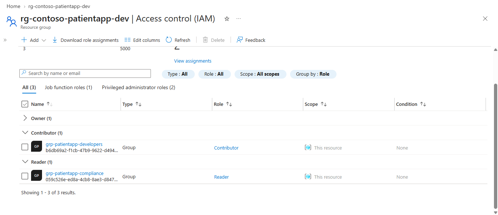
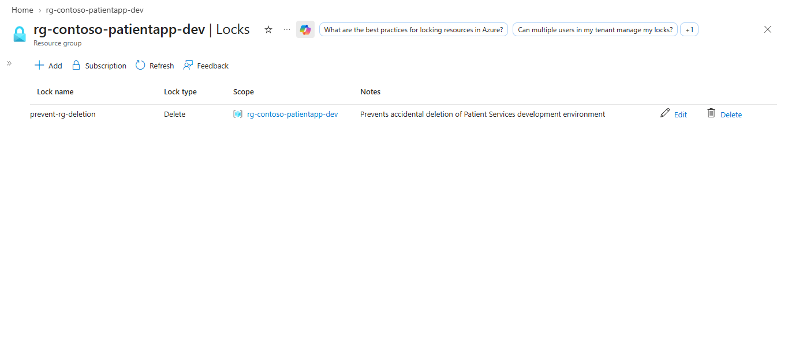
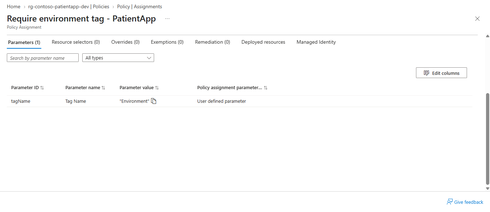
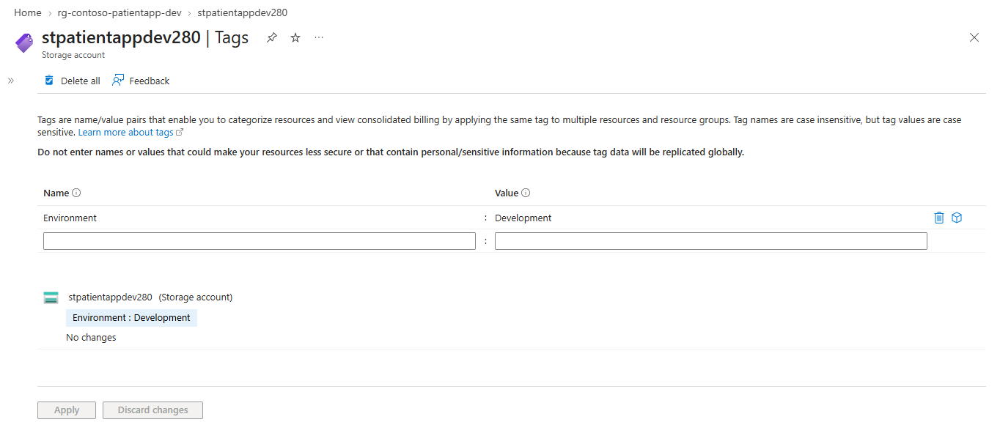

# Azure Identity and Governance for a Healthcare Application Environment

## Overview

This project demonstrates Azure identity and governance controls for a fictional healthcare organization, **Contoso Health Services**.

The goal was to build a secure development environment for a patient-services application while enforcing least-privilege access, resource protection, and governance standards.

## Business Scenario

Contoso Health Services is deploying a new patient-services application in Azure.

The development team needs permission to manage Azure resources, while the compliance team only needs read access.

The environment must also:

- Prevent accidental deletion
- Require an `Environment` tag on deployed resources
- Use group-based RBAC assignments
- Support permission verification and troubleshooting
- Follow least-privilege access principles

## Architecture

```text
Azure Subscription
│
└── rg-contoso-patientapp-dev
    │
    ├── Contributor
    │   └── grp-patientapp-developers
    │
    ├── Reader
    │   └── grp-patientapp-compliance
    │
    ├── Azure Policy
    │   └── Require Environment tag
    │
    ├── CanNotDelete Resource Lock
    │
    └── stpatientappdev280
        └── Environment = Development
```

## Objectives

- Create an Azure resource group for the application environment
- Create Microsoft Entra security groups
- Assign Azure RBAC roles at resource-group scope
- Apply a CanNotDelete resource lock
- Assign an Azure Policy requiring an `Environment` tag
- Test policy enforcement
- Validate access and troubleshoot governance issues

## Implementation

### 1. Resource Group and Tagging

Created the development resource group:

`rg-contoso-patientapp-dev`

The resource group serves as the primary governance scope for RBAC, Azure Policy, and resource protection.

A storage account was deployed inside the resource group as a test resource.



### 2. Microsoft Entra Groups and Azure RBAC

Created two Microsoft Entra security groups:

- `grp-patientapp-developers`
- `grp-patientapp-compliance`

Assigned the following roles:

| Group | Role | Purpose |
|---|---|---|
| `grp-patientapp-developers` | Contributor | Manage Azure resources without assigning access |
| `grp-patientapp-compliance` | Reader | Review resources without making changes |

The roles were assigned at the resource-group scope so permissions can be inherited by resources within the environment.



### 3. Resource Protection

Applied a **Delete/CanNotDelete** resource lock to:

`rg-contoso-patientapp-dev`

This allows authorized users to modify resources while helping prevent accidental deletion of the environment.



### 4. Azure Policy

Assigned an Azure Policy requiring deployed resources to contain the following tag:

`Environment`

The policy was assigned at the resource-group scope.



### 5. Policy Validation

Tested policy enforcement during deployment of an Azure Storage account.

Azure required the storage account to contain the configured `Environment` tag before it could satisfy the governance requirement.

The resource was configured with:

`Environment = Development`



## Troubleshooting

During the lab, an incorrect **Reader** role assignment needed to be removed from the development group.

The removal operation failed even though the administrator had sufficient RBAC permissions. Azure indicated that the scope was protected by a resource lock.

The issue was resolved by:

1. Temporarily removing the CanNotDelete lock
2. Removing the incorrect Reader role assignment
3. Assigning Reader to `grp-patientapp-compliance`
4. Recreating the CanNotDelete lock

This demonstrated that authorization through Azure RBAC does not necessarily override other Azure governance controls.

## Validation Results

| Test | Expected Result | Result |
|---|---|---|
| Development group assigned Contributor | Resource management access | Passed |
| Compliance group assigned Reader | Read-only access | Passed |
| Resource missing required Environment tag | Policy identifies noncompliance | Passed |
| Resource configured with Environment tag | Compliant configuration | Passed |
| Delete operation at protected scope | Blocked by resource lock | Passed |
| Role assignment removal while scope locked | Blocked until lock removed | Passed |

## Security Decisions

### Least Privilege

The development group received **Contributor** rather than **Owner** because developers need to manage application resources but do not need permission to manage Azure role assignments.

The compliance group received **Reader**, allowing members to inspect resources without modifying them.

### Group-Based Access

Azure roles were assigned to Microsoft Entra security groups rather than directly to individual users.

This simplifies access administration because users can be added to or removed from groups without changing the Azure role assignments themselves.

### Governance Enforcement

Azure Policy was used to enforce a resource-tagging requirement instead of relying solely on administrators to apply tags manually.

### Resource Protection

A CanNotDelete lock was applied to reduce the risk of accidental deletion of the development environment.

## Key Azure Concepts Demonstrated

- Microsoft Entra ID
- Security groups
- Azure RBAC
- Contributor and Reader roles
- Azure management scopes
- RBAC inheritance
- Azure Policy
- Policy assignments
- Resource tags
- Resource locks
- Least privilege
- Azure governance
- Azure troubleshooting

## Lessons Learned

This project reinforced the difference between several Azure governance controls:

- **Azure RBAC** determines who is authorized to perform actions.
- **Azure Policy** determines which resource configurations are permitted or required.
- **Resource locks** can prevent management operations even when RBAC otherwise permits them.

The troubleshooting scenario also demonstrated why administrators should check RBAC, Policy, resource locks, and Azure error messages when investigating failed management operations.

## Cleanup and Cost Notes

This lab used lightweight Azure resources with minimal expected cost.

The storage account can be reused in later AZ-104 labs.

Before deleting the environment, the resource lock must first be removed so the protected resources and resource group can be deleted successfully.
